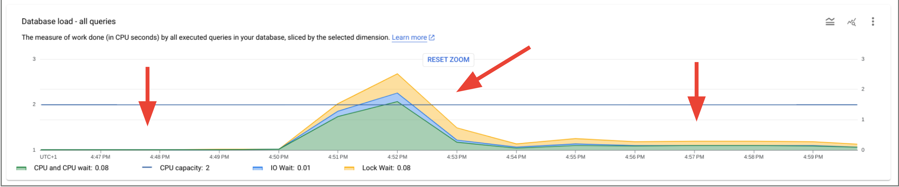

# Query insights on Cloud SQL for Postgres

This repository will provision a single Cloud SQL instance (Postgres) and generate some data and queries from a separate VM on Compute Engine to be able to demonstrate Query Insights in the Google Cloud console.

Once the infrastructure is deployed, wait several minutes (10/15) to get some data populated in query insights, and then execute a bulk insert to create an issue in your application:

```
INSERT INTO sales_history (order_id, product_id, purchase_price)
SELECT floor(random() * 50 + 1), floor(random() * 50 + 1), floor(random() * 100 + 1)
FROM generate_series(1, 100000000) AS i;
```

After that, you will see something like the following showing a normal workload, a big spike and then poor performances.



You can then deep dive in Query insights to show execution plans, indexes recommendation, etc.

## Required variables

Create a `terraform.tfvars` file containing the following variables:

```
project_id = "my-gcp-project"
```

## What is provisioned

1. A Cloud SQL for Postgres with a public IP and query insights flags
2. A database called `cymbalshop` with several tables (see `setup.sql` file to get more details) and some data
3. A VM on Compute engine to run the scripts and queries that generate the load. See `setup.sh.tftpl` for more details.

